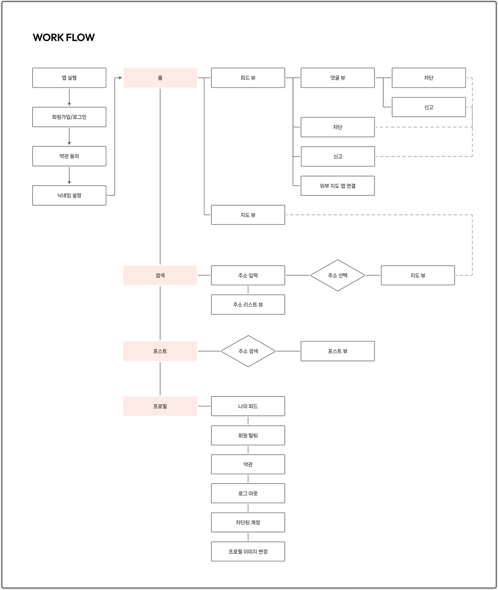
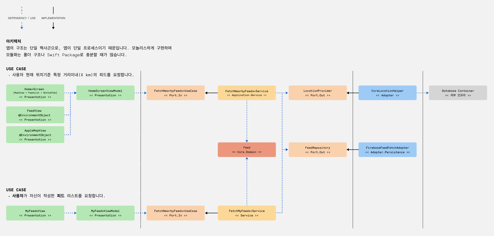
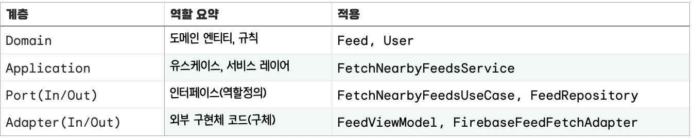

<div align="center">
 <h1>coco</h1>
</div>

> 이 코드는 실제로 운영 중인 iOS 앱의 내부 설계, 아키텍처, 주요 유스케이스 및 테스트 전략을 설명하기 위해 일부 공개된 것입니다. 실제 앱의 전체 소스 코드나 세부 로직은 포함되어 있지 않으며, 일부 코드는 예시 및 구조적 이해를 돕기 위한 샘플일 뿐, 실제 구현과는 차이가 있을 수 있습니다.

## 개요

이 앱은 SwiftUI로 개발된 iOS 애플리케이션으로, 사용자가 현재 위치를 기반으로 소식을 공유하거나 질문과 답변을 주고받을 수 있도록 제작되었습니다.  사용자는 2km 이내의 피드를 확인하고, 특정 장소를 태그하여 게시물을 작성하며, 이를 지도에서 시각적으로 확인할 수 있습니다. 이 앱은 지역 커뮤니티와의 상호작용을 강화하며, 직관적이고 매끄러운 사용자 경험을 제공하는 것을 목표로 합니다.

<br />

## 주요 기능 식별

* **위치 기반 피드**: 사용자의 현재 위치에서 2km 이내의 게시물을 실시간으로 조회하고 표시.
* **지도 통합**: 사용자가 선택한 위치를 지도에 마커로 표시하여 시각적 상호작용 제공.
- **회원가입 및 인증**: Apple ID를 통한 OAuth 기반 로그인으로 사용자 인증 구현.
- **미디어 지원**: 이미지 업로드(압축), 신고, 차단, 댓글 기능 구현

<br />

## 기술 스택

* Firebase: 실시간 데이터베이스, 인증, GeoHash 기반 위치별 데이터 쿼리 등 핵심 백엔드 인프라로 활용. 초기 무료 플랜 제공.
    * GeoHash: 위치 기반 데이터 필터링 및 쿼리 최적화를 위한 공간 인덱싱 기법. 
* MapKit: iOS 기본 제공 지도 기능을 사용하여 무료로 지도 서비스 제공.
* 의존성 주입 라이브러리(Factory): 컴포넌트 간 의존성을 효과적으로 관리.


<br />

## 프로젝트 구조
하단 트리는 실제 앱 코드 소스를 약식화한 예시 입니다.

```swift
├── CoCo
│   ├── CoCoApp.swift
│   ├── ContentView.swift
│   ├── Core
│   │   └── Domain
│   │       ├── Feed.swift
│   │       └── User.swift
│   ├── DI
│   │   └── Container+Injection.swift
│   ├── Features
│   │   └── Feed
│   │       ├── Adapter
│   │       │   └── Out
│   │       │       ├── CoreLocationAdapter.swift
│   │       │       └── FirebaseFeedFetchAdapter.swift
│   │       ├── Application
│   │       │   ├── Port
│   │       │   │   ├── In
│   │       │   │   │   ├── FetchMyFeedsUseCase.swift
│   │       │   │   │   └── FetchNearbyFeedsUseCase.swift
│   │       │   │   └── Out
│   │       │   │       ├── FeedRepository.swift
│   │       │   │       └── LocationProvider.swift
│   │       │   └── Service
│   │       │       ├── FetchMyFeedsService.swift
│   │       │       └── FetchNearbyFeedsService.swift
│   │       └── Presentation
│   │           ├── View
│   │           │   └── MyFeedsView.swift
│   │           └── ViewModel
│   │               └── MyFeedsViewModel.swift
│   └── Router
│       └── UI
│           ├── View
│           │   ├── FeedListBottomSheetView.swift
│           │   ├── HomeScreenView.swift
│           │   └── MapView.swift
│           └── ViewModel
│               └── HomeScreenViewModel.swift
├── CoCoTests
│   ├── CoCoTests.swift
│   └── Mocks
│       └── FetchNearbyFeeds+Mocks.swift
├── CoCoUITests
│   ├── CoCoUITests.swift
│   └── CoCoUITestsLaunchTests.swift
└── README.md
```

<br />

## Work Flow




<br />

## 아키텍처 선택



### 헥사고날 아키텍처(포트 앤 아댑터)
헥사고날 아키텍처(Por정 and Adapters)를 채택하여 비즈니스 로직과 외부 서비스를 분리했습니다. 이를 통해 특정 기술(예: Firebase, MapKit 등)에 대한 의존성을 최소화하고, 유지보수 및 확장성을 높였습니다. 주요 구성 요소는 다음과 같습니다:



### 도메인 레이어

```swift
@MemberwiseInit(.public)
struct Feed: Equatable, Identifiable, Hashable {
    public let id: UUID = .init()
    @Init(.public) public let authorId: String
    @Init(.public) public let content: String
    @Init(.public) public let location: Coordinate
}
```

- **역할**: 외부 프레임워크에 의존하지 않는 순수 비즈니스 엔티티와 로직을 포함. 
- **특징**: 어떤 외부 계층에도 의존하지 않습니다.
### 애플리케이션 레이어

### 서비스 

```swift
// MARK: 서비스레이어 구현 (어플리케이션)
class FetchNearbyFeedsService: FetchNearbyFeedsUseCase {
    @Injected(\.locationProvider) private var locationProvider: LocationProvider
    @Injected(\.feedRepository) private var feedRepository: FeedRepository

    // MARK: - 서비스레이어의 역할
    func execute(radiusInMeters: Double) async throws -> [Feed] {
		// 1. 위치 정보 가져오기
		let currentLocation = try await locationProvider.getCurrentLocation()
		// 2. 가져온 위치를 기반으로 Repository에 피드 요청
		let feeds = try await feedRepository.fetchFeeds(near: currentLocation, within: radiusInMeters)
		// --- 가져온 피드를 거리순으로 정렬하거나, 특정 조건으로 필터링 ---
		return feeds
    }
}
```

* **역할**: 서비스 레이어는 외부의 요청을 받아 애플리케이션의 핵심 비즈니스 로직을 실행하고, 그 결과를 다시 외부로 전달하는 모든 과정을 지휘합니다.  

### 인바운드 포트

```swift
// PORT.IN
// API
protocol FetchMyFeedsUseCase {
    func execute(userId: String) async throws -> [Feed]
}
```

- **역할**: 인터페이스(프로토콜)로 구현하며, 외부의 요청을 받아 내부의 비즈니스 로직을 실행하기 위한 부분입니다. 서비스가 구현해야할 API 명세를 정의합니다.
- **특징**: 코드 상에서는 ViewModel(외부요소)이 애플리케이션의 어떤 기능을 사용할 수 있는지 명시합니다. "피드를 가져온다"는 기능을 정의합니다.

### 아웃바운드 포트

```swift
protocol FeedRepository {
    /// 사용자 현재 위치 기준 특정 거리의 피드를 가져옵니다.
    func fetchFeeds(near location: CLLocation, within radius: Double) async throws -> [Feed]
}
```

- **역할**: 내부의 비즈니스 로직이 외부 시스템(DB, API 등)의 기능을 필요로 할 때 사용하는 의존성 명세입니다. "데이터를 저장해줘", "현재 위치를 알려줘"와 같은 요구사항을 인터페이스로 정의합니다.
- **특징**: 서비스 계층은 이 포트(프로토콜)에만 의존합니다. 실제 구현이 Firebase인지, CoreLocation인지, 아니면 테스트용 Mock 객체인지는 전혀 알지 못합니다. 이를 통해 의존성 역전이 일어나 핵심 로직을 외부 기술로부터 보호합니다.

### 어댑터
포트를 구현하는 구현체입니다. 외부 레이어와 포트 사이에서 데이터를 변환하고 통신하는 역할을 담당합니다.

### 인바운드 어댑터

```swift
@Observable
class HomeScreenViewModel {
    private(set) var radiusInMeters: Double = 2000
    @Injected(\.fetchNearbyFeedsUseCase) private var fetchNearbyFeedsUseCase: FetchNearbyFeedsUseCase

    @MainActor
    func loadNearbyFeeds() async {
		let loadedFeeds = try await fetchNearbyFeedsUseCase.execute(radiusInMeters: radiusInMeters)
		feeds = loadedFeeds
    }
}
```

- **역할**: 사용자의 입력이나 외부 시스템의 요청을 인바운드 포트를 통해 애플리케이션 내부로 전달합니다. 즉, 애플리케이션을 구동시키는 역할을 합니다.
- **특징**: SwiftUI의 View에서 발생한 사용자 이벤트등을 통해 `FetchNearbyFeedsUseCase`와 같은 인바운드 포트를 호출합니다. UI 프레임워크와 애플리케이션 핵심 로직을 연결하는 역할을 합니다.

### 아웃바운드 어댑터

```swift
class FirebaseFeedFetchAdapter: FeedRepository {
    // private let db: Firestore // 실제 프로젝트에서는 Firestore 인스턴스를 주입받습니다.
    private let feedsCollection: String
    
    init(collectionName: String = "feeds") { self.feedsCollection = collectionName }

    /// 이 메서드는 외부 시스템(Firebase)과 통신하는 Adapter의 역할을 보여줍니다.
    /// 실제 구현에서는 Firestore와 GeoFire를 사용하여 특정 위치 주변의 피드를 쿼리합니다.
    func fetchFeeds(near location: CLLocation, within radius: Double = 2000.0) async throws -> [Feed] {
        // 샘플 이므로, 더미 데이터를 반환합니다.
        // 실제 앱의 복잡한 로직 대신 아키텍처를 보여주는 데 집중합니다.
        return [
            Feed(authorId: "01X2XFF",  content: "Firebase에서 가져온 첫 번째 피드",location: Coordinate(latitude: 37.5665, longitude: 126.9780)) 
        ]
    }
}
```

- **역할**: 아웃바운드 포트를 실제로 구현한 클래스입니다. 애플리케이션의 요청에 따라 구동되는 역할을 합니다. 외부 인프라와의 통신을 담당합니다.
- **특징**:
   - `FirebaseFeedFetchAdapter`는 `FeedRepository` 포트를 구현하여 실제로 Firestore SDK를 사용해 데이터를 가져옵니다. 
   - 만약 데이터베이스를 Firebase에서 다른 것으로 교체한다면, 서비스 로직이나 포트는 전혀 건드리지 않고 이 어답터만 새로 만들어 교체하면 됩니다.

<br />

## 구현

비즈니스 도메인 및 유스케이스 식별

**사용자가 홈 스크린에 접근 시**,
* 사용자 현재 위치에 등록한 피드(게시글)를 확인할 수 있어야 합니다.
* 피드는 사용자의 현재 위치 기준 최대 2km이내 피드가 제공됩니다.
* 지도를 움직인뒤 해당 위치에서 요청을 하면 해당 위치 기준 2km이내의 피드들을 가져올 수 있습니다.
* 지도에 사용자 주변 피드의 위치를 표시한 마커를 표시합니다.

**사용자가 피드를 등록할 시**,
* 새로운 게시글 등록 시 데이터베이스에 저장합니다.
* 새로운 피드가 등록 되면 업데이트된 피드를 다시 불러옵니다. 해당 위치 사용자는 새로운 피드를 확인할 수 있습니다.  
  
**사용자가 댓글 등록 시**,
* 댓글을 데이터베이스에 저장합니다.

**사용자가 프로필 사진을 업데이트/수정 시,**
* 사용자가 본인 프로필 이미지를 업로드 합니다.


<br />

## 테스트

### 시나리오 별 테스트

- **목표**: 비즈니스 규칙을 검증합니다. (외부 시스템(실제 위치, Firebase) 없이도 서비스의 비즈니스 로직(위치 결정, 경계 계산, 데이터 호출, 중복 제거, 거리 필터링, 정렬)이 올바르게 동작하는지 완벽하게 격리하여 테스트할 수 있습니다.)
- **대상**: 피드는 사용자의 현재 위치 기준 최대 2km이내 피드가 제공됩니다.
- **방법**: 서비스가 의존하는 포트(`FeedRepository`, `LocationProvider`)를 Mock 객체로 대체하여 테스트합니다. 이를 통해 Firebase나 CoreLocation의 실제 동작과 무관하게 서비스의 로직만 순수하게 테스트할 수 있습니다.

<br />

## 에러처리

에러처리는 각 계층(Layer)의 역할에 맞게 분리해서 처리합니다. 에러처리를 위한 코드는 Port에서 관리합니다.

"주변 피드 목록 요청" 흐름을 예시로 오류 처리 과정을 단계별로 살펴보겠습니다.

1. **발생 및 변환 (Adapter)**: `CoreLocationAdapter`에서 위치 정보 권한이 거부되면 `LocationError.authorizationDenied` 오류가 발생합니다. 이 오류는 상위 계층으로 전파됩니다.
2. **결정 및 조율 (Service)**: `FetchNearbyFeedsService`는 `LocationError`를 받고, "위치 정보 없이는 주변 피드를 가져올 수 없다" 고 판단하여 전체 유스케이스를 실패 처리하고, 이 오류를 `FetchFeedsError.locationError`로 변환하여 상위로 반환합니다.
3. **표현 (ViewModel)**: `HomeScreenViewModel`은 `FetchFeedsError.locationError`를 받고, `errorMessage` 상태를 "위치 정보를 가져오는데 실패했습니다." 로 업데이트 하여 사용자에게 적절한 메시지를 보여줍니다.

이처럼 각 계층이 자신의 역할에 맞는 오류 처리 책임을 수행할 때, 유지 보수가 용이하고 확장 가능한 애플리케이션을 만들 수 있습니다.


1. Adapter Layer
- **역할**: 외부 시스템(CoreLocation(Swift 내부 기능이지만, 아키텍처 특성상 외부 시스템으로 식별), Firebase 등)에서 발생하는 구체적인(low-level) 오류를 감지하고, 이를 애플리케이션의 비즈니스 로직이 이해할 수 있는 일반적인 오류 형태로 **변환하고 전파합니다.
* **대상**: `CoreLocationAdapter`, `FirebaseFeedFetchAdapter`
- **예시**: `CoreLocationAdapter`에서 위치 정보 사용 권한이 거부되면, `CLLocationManager`의 상태를 확인하여 `LocationError.authorizationDenied`라는 도메인 오류를 발생시킵니다.
- **이유**: 이렇게 함으로써 애플리케이션의 핵심 로직이 CoreLocation, Firebase 같은 특정 기술에 종속되지 않게 됩니다. 나중에 위치 제공자나, 데이터베이스를 다른 것으로 교체하더라도 Service 계층의 코드는 변경할 필요가 없어집니다.

1. Service / Use Case Layer (Application Layer)
	이 계층은 **비즈니스 관점의 오류를 처리하고 복구 전략을 결정**하는 가장 중요한 지점입니다.
	- **역할**: Adapter로부터 전달받은 도메인 오류를 바탕으로 비즈니스 규칙에 따라 다음에 어떤 행동을 할지 **결정합니다.
	- **대상**: `FetchNearbyFeedsService`, `FetchMyFeedsService` 등
	- **예시**:
	    - `FetchNearbyFeedsService`가 `LocationProvider`로부터 `LocationError.authorizationDenied` 오류를 받았습니다.
	    - 이때 서비스는 "위치 정보 없이는 주변 피드를 가져올 수 없으니, 작업을 중단하고 '위치 관련 오류'가 발생했음을 상위 계층에 알려야 한다고 결정합니다."
	    - 이를 위해 `LocationError`를 `FetchFeedsError.locationError`로 감싸서 반환합니다.
	    - 필요하다면 재시도 로직을 구현할 수도 있는 최적의 위치입니다.
	- **이유**: 여러 Adapter와 상호작용하며 전체 비즈니스 흐름을 관장하는 곳은 Service 계층뿐입니다. 따라서 어떤 오류가 발생했을 때 전체 작업의 성공/실패를 판단하고 그에 따른 흐름을 제어할 책임이 있습니다.

## 3. UI Layer (ViewModel)
이 계층은 처리된 오류를 **사용자에게 어떻게 보여줄지 결정**하는 최종 단계입니다.
- **역할**: Service/Use Case 계층에서 전달받은 최종 오류를 사용자 친화적인 방식으로 **표현**합니다.
- **대상**: `HomeScreenViewModel`, `MyFeedsViewModel` 등
- **예시**:
    - `HomeScreenViewModel`이 `fetchNearbyFeedsUseCase`로 부터 `FetchFeedsError.locationError` 오류를 받습니다. 
    - ViewModel은 이 오류를 해석하여 UI 상태인 `@errorMessage` 를 "위치 정보를 가져오는데 실패했습니다." 라는 문자열로 업데이트 합니다.
- **이유**: UI 계층은 비즈니스 로직을 몰라야 합니다. 오직 전달받은 상태(데이터 또는 오류)를 어떻게 시각적으로 표현할지에만 집중해야 합니다. 이를 통해 관심사를 명확히 분리할 수 있습니다.


<br />

## 문제 인식과 해결


**위치 문제**
1. 한국에서 일본에 출시할 앱으로, 위치 서비스를 활용해야함 
	1. 시뮬레이터와 gpx를 활용. 현재 위치를 임의로 설정 후, 해당 위치 주변 좌표로 작성된 피드를 불러오는지 테스트 후 구현.

  
**상태 동기화 와 일관성 문제**

**문제**: 여러 뷰(지도 뷰, 피드 뷰) 간 상태 동기화와 일관성 유지. 예를 들어, 피드 뷰에서 선택한 게시물이 지도 뷰에 즉시 반영되어야 한다거나, 사용자 현재 위치 기준 2km 이내의 피드를 표시하는 마커가 MapView에 보임과 동시에, BottomSheetView에 피드 리스트로 제공되어야 합니다.

**해결책**: 상태 호이스팅 기법을 적용하여 공유 상태(selectedFeed, selectedLocation)를 상위 뷰 모델(AppViewModel)에서 중앙 관리. 이를 통해 단일 진실 공급원(SSOT)을 확립하고, 뷰 간 데이터 불일치를 제거했습니다. 

```swift
@Observable
class HomeScreenViewModel {
    private(set) var feeds: [Feed] = []
    private(set) var selectedFeed: Feed?
    
    func selectFeed(_ feed: Feed) {
        selectedFeed = feed
        updateMapRegion(to: feed.location)
    }
}

// HomeScreen에서 ViewModel 생성
struct HomeScreen: View {
    @State private var viewModel: HomeScreenViewModel

    init(viewModel: HomeScreenViewModel) {
        _viewModel = State(wrappedValue: viewModel)
    }

    var body: some View {
        ZStack(alignment: .bottom) {
            MapView()
            FeedListBottomSheet()
            BottomTab()
        }
        .environmentObject(viewModel)
        .task { await viewModel.loadNearbyFeeds() }
    }
}
	
// 하위 View에서 사용
struct FeedListBottomSheet: View { 
	@EnvironmentObject var viewModel: FeedMapSharedViewModel 
	// viewModel.feeds 사용
}
```

초기 구현시 공통 상태가 필요한 뷰를 개별 객체로 식별하여, 각 View에 1:1로 매칭되는 ViewModel을 생성했었고, 하나의 화면(부모 뷰)을 구성하는 여러 뷰가 각자의 ViewModel을 통해 동일한 유스케이스를 개별적으로 호출하면서 문제가 발생.

`HomeScreen`의 경우, `MapView`와 `SheetContentView`가 거의 동시에 렌더링되면서 각자의 ViewModel(`MapViewModel`, `FeedDetailViewModel`)이 `FetchNearbyFeedsUseCase`를 개별적으로 호출. 이로 인해 다음과 같은 두 가지 문제가 발생.

- **중복 호출**: 동일한 비즈니스 로직과 DB 조회가 짧은 시간 안에 중복 실행되어, 불필요한 네트워크 트래픽과 API 호출 비용을 유발.
- **데이터 불일치 위험**: 두 요청의 응답 시점에 미세한 차이가 발생할 경우, 지도에 표시되는 마커의 수와 리스트에 보이는 피드의 수가 일치하지 않는 등 데이터의 정합성이 깨질 위험이 존재.

이런 양방향 상호작용이 필요한 케이스에서는 App+ViewModel을 통한 중앙 집중식 상태 관리가 가장 적합한 패턴이라고 파악. 이 문제에 대한 해결책으로 공유되는 모든 상태와 데이터를 하나의 상위(부모) ViewModel이 소유하고 관리하도록 구조를 변경.

<br />

## 보완 및 개선점

헥사고날 아키텍처 도입으로 인해 폴더 및 코드 구조의 복잡성이 증가할 수 있으며, 소규모 프로젝트의 경우 오히려 복잡성을 야기할 수 있다는 점을 유의해야 합니다. 또한, 헥사고날 아키텍처를 실제 앱에 완벽하게 1:1로 대응하기 어려운 경우가 많으므로, 프로젝트의 규모와 성격에 따라 유연하게 적용하는 것이 중요합니다.
